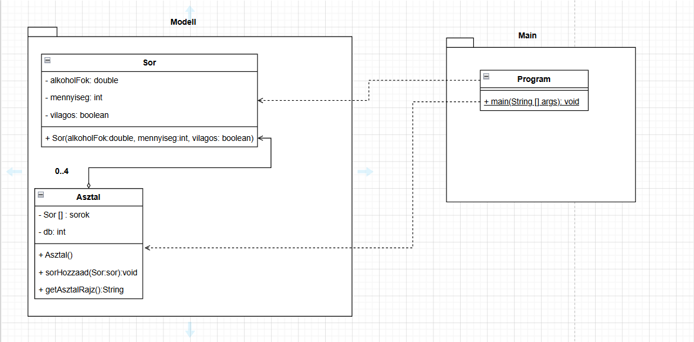

# Sörök az asztalon - Java OOP feladat

Ez a program sörök elhelyezését és jellemzőit kezeli egy asztalon, vizuális és szöveges megjelenítéssel.

## UML Osztálydiagram

## Funkciók
* Maximum 4 sör elhelyezése
* Alkohol fok, mennyiség és típus tárolása
* Karakteres (ASCII) vizuális nézet
